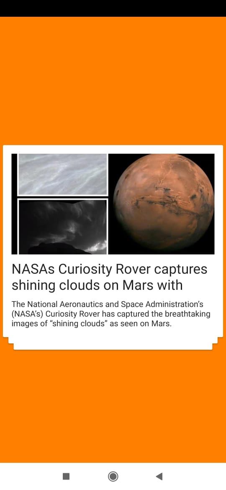
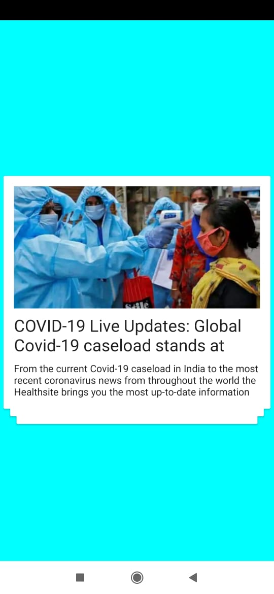
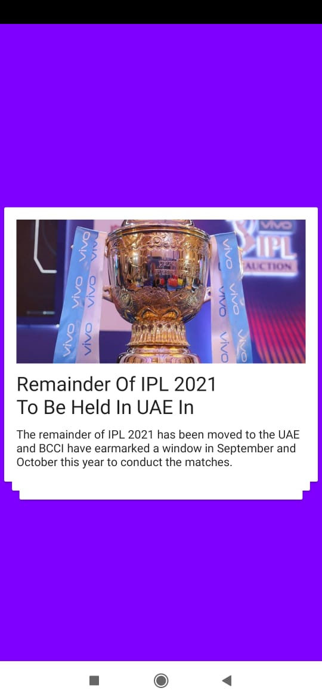
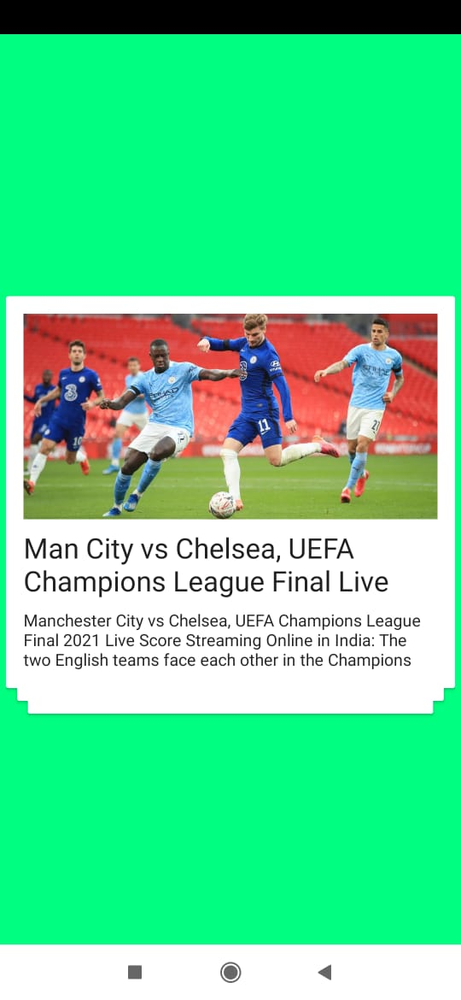
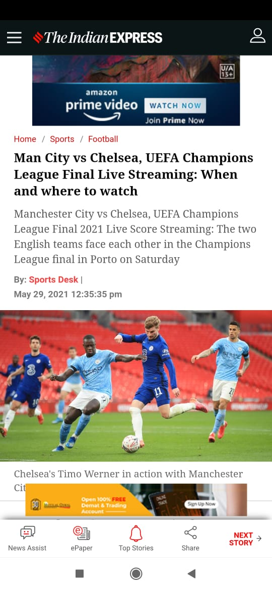
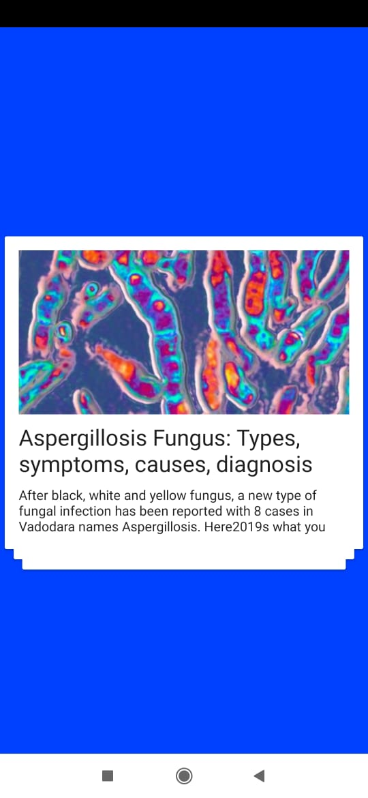
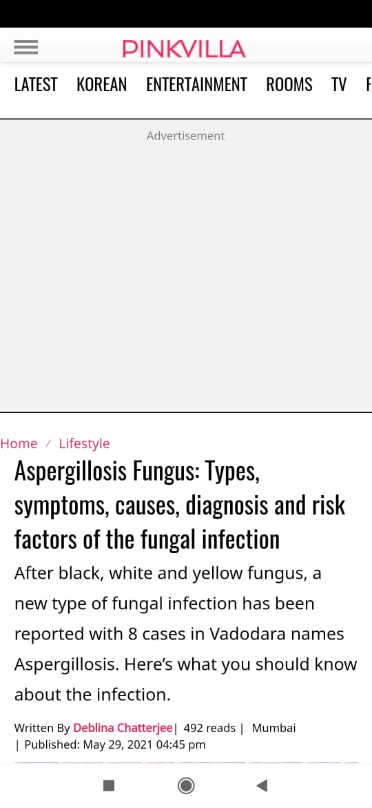

# CrispNews
A portal to get crisp news and stay updated.

### Screenshots

  <kbd>
  
  </kbd>
   &ensp;
   <kbd>
   
   </kbd>
  &ensp;
   <kbd>
   
   </kbd>

<h3>&ensp; Up & Down Swipable Crisp News with dynamic background color </h3>

 
 

  <kbd>
  
  </kbd>
   &ensp;
   <kbd>
   
   </kbd>
  

 
   <kbd>
  
  </kbd>
  &ensp;
   <kbd>
   
   </kbd>
  

<h3>&ensp; Webview is implemented. User can click relevant news and get the details from webview. </h3>

 
 

 
   <kbd>
  
  </kbd>
  

<h3>&ensp; Users receive ads after every 8 news swipped. At present an Interstitial Test Ad is implemented </h3>

 

